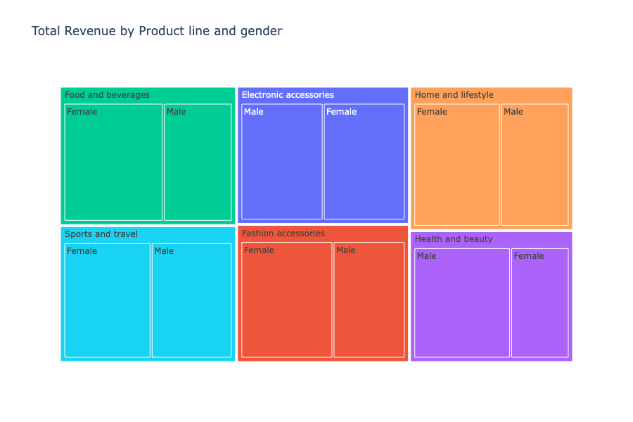
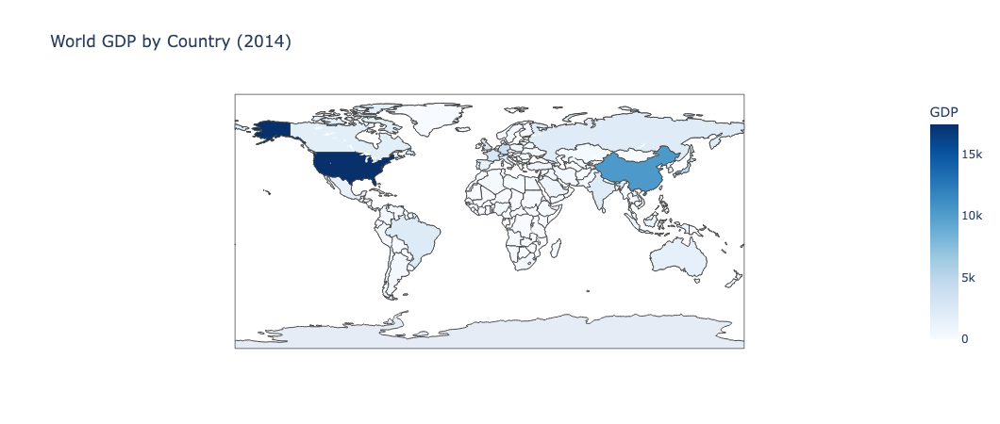

> This project showcases my ability to work with real-world datasets using Python, including data cleaning, transformation, visualization, and storytelling.
> 

## Datasets Used

| Dataset | Source |
| --- | --- |
| Supermarket Sales | [Kaggle](https://www.kaggle.com/datasets/aungpyaeap/supermarket-sales) |
| German Credit Risk | [Kaggle](https://www.kaggle.com/datasets/uciml/german-credit) |
| Udemy Courses | [Kaggle](https://www.kaggle.com/datasets/andrewmvd/udemy-courses) |
| World GDP (2014) | [Kaggle](https://www.kaggle.com/datasets/wsaqaf/2014_world_gdp_with_codes.csv) |

## Methodology

- **Tools**: Python (Jupyter Notebook)
- **Libraries**: `pandas`, `numpy`, `matplotlib`, `seaborn`, `plotly`
- **Steps**:
    - Load & explore data
    - Clean, reformat, and engineer features
    - Visualize patterns and trends
    - Extract insights
    - Recommend actions based on findings

---

## Project 1: Supermarket Sales Analysis

**Overview**

Analyzed retail sales transactions to understand purchasing behavior, revenue trends, and differences across branches and customer segments.

### Data Preparation

- Parsed date fields and generated time-based features (Day, Month, Weekday).
- Verified data integrity and confirmed no missing values.

### Key Findings

- Transaction volume peaks in January, followed by March, with February showing the lowest activity.
- Revenue follows a similar trend, with January leading, March in second, and February lagging behind significantly.
- Saturday stands out as the highest revenue-generating day, while Monday records the lowest.
- Peak transaction hours occur around midday and early evening, with noticeable dips in the late afternoon and after late evening.
- "Food and Beverages" and "Electronic Accessories" are top revenue drivers, while "Fashion Accessories" underperforms in comparison.

### Insights

- High transaction counts and revenue in January may be tied to seasonal trends like New Year shopping or promotions, while February’s dip could stem from shorter days and post-holiday fatigue.
- Saturday and Tuesday emerge as key shopping days, likely influenced by consumer schedules, with Monday showing reduced activity possibly due to the start of the workweek.
- Midday and early evening spikes suggest customers prefer shopping during lunch breaks or after work, with quieter hours in the late afternoon indicating a potential lull in demand.
- Strong performance in "Food and Beverages" and "Electronic Accessories" highlights their popularity, while "Fashion Accessories" struggles to attract similar interest.
- Gender preferences in spending are mostly balanced, though slight variations exist across product categories.

### Recommendations

- Focus promotional efforts in January to capitalize on heightened demand, while introducing targeted campaigns or discounts in February to lift its lower performance.
- Enhance staffing and resources on Saturdays to meet peak demand, and consider special offers on Mondays to boost traffic during this slower period.
- Prioritize staffing and promotions during midday and early evening peak hours, while experimenting with flash sales or incentives during late afternoon lulls to drive activity.
- Emphasize marketing for "Food and Beverages" and "Electronic Accessories" to sustain their profitability, and explore strategies like targeted promotions to revive interest in "Fashion Accessories."
- Tailor marketing slightly by gender where preferences differ, such as tech-focused ads for male shoppers and fashion campaigns for female consumers, to optimize engagement.

⚠️ Note: Charts Not Displayed on GitHub

> Some visualizations might not render properly on GitHub preview due to the use of interactive or non-static output formats. Below are the affected charts
> 

---

## Project 2: German Credit Risk Analysis

**Overview**

Explored demographic and financial variables tied to creditworthiness in order to understand behavioral patterns behind good vs. bad credit outcomes.

### Data Preparation

- Renamed and decoded categorical features.
- Mapped binary labels to “Good” and “Bad” credit risk.
- Ensured data completeness and readability.

### Key Findings

- About **30% of applicants** were labeled “Bad” credit risk.
- **Longer loan durations** were associated with higher risk.
- **Younger applicants (<30)** showed higher bad-risk ratios.
- Loans for **non-essential items** (e.g., electronics, furniture) were riskier.
- Applicants living with **parents** had slightly worse credit profiles.

### Insights

- Loan term is a meaningful risk factor - longer terms need tighter controls.
- Younger borrowers may lack credit history or stable income.
- Loan purpose can reflect financial behavior and maturity.
- Housing status may act as a behavioral signal.

### Recommendations

- Strengthen checks for long duration loans, especially among new applicants.
- Tailor products for young customers with educational support.
- Add behavioral filters for discretionary spending loans.
- Explore using housing status in credit scoring models.
